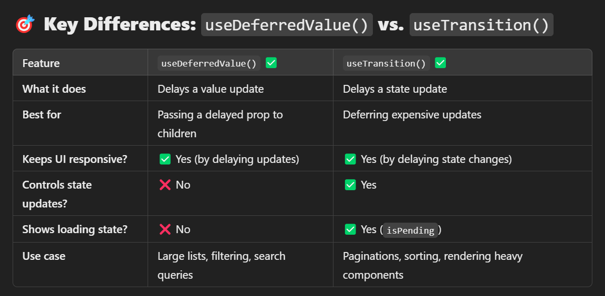

✅ 1. useDeferredValue() – Delays a Value Update
📌 Best for:
✔ Passing a delayed version of a value to a child component.
✔ Handling expensive computations (like filtering large lists).
✔ Keeping input fields responsive while heavy updates happen.

## Example

```js
import { useState, useDeferredValue } from "react";

function SearchResults({ query }) {
const deferredQuery = useDeferredValue(query); // Delayed query

// Simulate a slow filtering process
const filteredResults = Array(10000)
.fill(0)
.map((\_, i) => `Item ${i}`)
.filter((item) => item.includes(deferredQuery));

return (
<ul>
{filteredResults.map((item, index) => (
<li key={index}>{item}</li>
))}
</ul>
);
}

export default function App() {
const [query, setQuery] = useState("");

return (
<div>
<input
type="text"
value={query}
onChange={(e) => setQuery(e.target.value)}
placeholder="Search..."
/>
<SearchResults query={query} />
</div>
);
}

```

🔥 Why useDeferredValue()?
✔ Keeps input fast while filtering updates slightly later.
✔ Prevents UI freezes by deferring a value update.
✔ Works well inside child components.

---

✅ 2. useTransition() – Controls State Updates
📌 Best for:
✔ Marking less important state updates as low priority.
✔ Keeping UI interactive while heavy updates happen.
✔ Controlling when and how state updates occur.

```js
import { useState, useTransition } from "react";

export default function App() {
  const [query, setQuery] = useState("");
  const [filteredResults, setFilteredResults] = useState([]);
  const [isPending, startTransition] = useTransition();

  const handleSearch = (e) => {
    const newQuery = e.target.value;
    setQuery(newQuery);

    // Delay expensive computation
    startTransition(() => {
      setFilteredResults(
        Array(10000)
          .fill(0)
          .map((_, i) => `Item ${i}`)
          .filter((item) => item.includes(newQuery))
      );
    });
  };

  return (
    <div>
      <input
        type="text"
        value={query}
        onChange={handleSearch}
        placeholder="Search..."
      />
      {isPending && <p>Loading...</p>} {/* Shows loading indicator */}
      <ul>
        {filteredResults.map((item, index) => (
          <li key={index}>{item}</li>
        ))}
      </ul>
    </div>
  );
}
```

🔥 Why useTransition()?
✔ Keeps the input responsive while delaying the expensive update.
✔ Shows a loading state (isPending) during slow updates.
✔ Works well for managing multiple state updates.



🎯 When to Use Which?
🔹 Use useDeferredValue() when:
✅ You are passing a prop that updates too fast (e.g., search query).
✅ A child component needs a delayed version of a value.
✅ You don’t need a loading state (isPending).

🔹 Use useTransition() when:
✅ You want to delay a state update to prevent UI blocking.
✅ You need a loading indicator (isPending).
✅ You are dealing with complex state updates (e.g., pagination, filtering).
